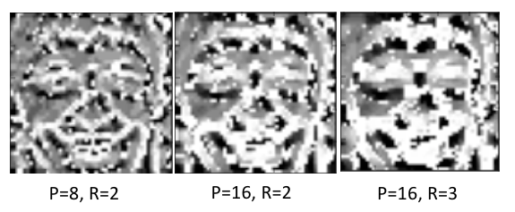
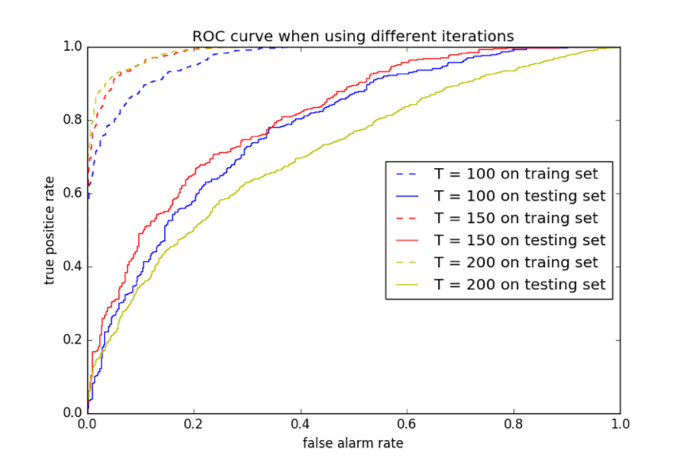
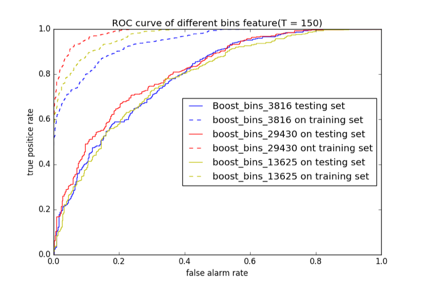
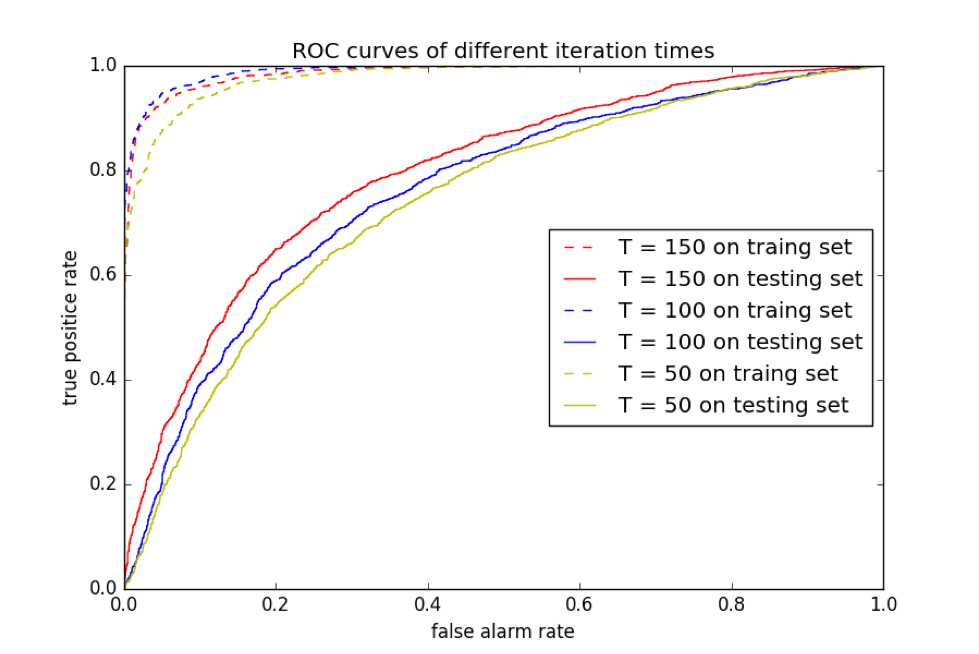
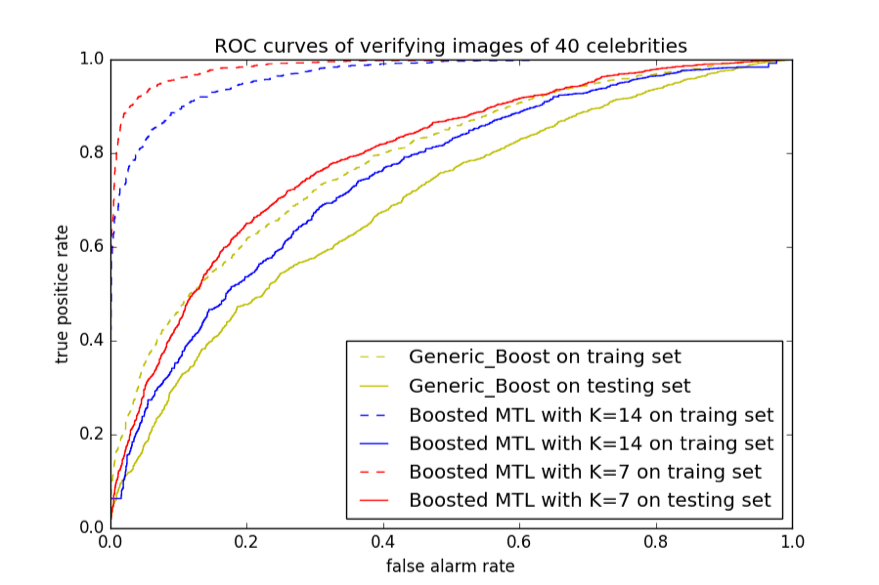

# Boosted multi-task learning for face verification 
This is an implementation of [Boosted multi-task learning for face verification with applications to web image and video search](http://ieeexplore.ieee.org/document/5206736/?reload=true) in C++. The repository implemented Boosted Multi-Task Learning algorithm for face cerification task and did some experiments for the evaluation.

Includes:
* LBP(Local Binary Pattern)  Features Extraction
* Adaboost Learning with LBP features
* Boosted Multi-Task Learning

## LBP Features Extraction
* LBP Feature (Radius = 2, Points = 8)

* LBP results of different P&R values in my experiment

## Adaboost Learning with LBP Features
* ROC curve of different Iteration times and precision results

* Roc curve of different bins features

## Boosted Multi-Task Learning
* Different Iteration times

* ROC curves of verifying images of 40 celebrities

